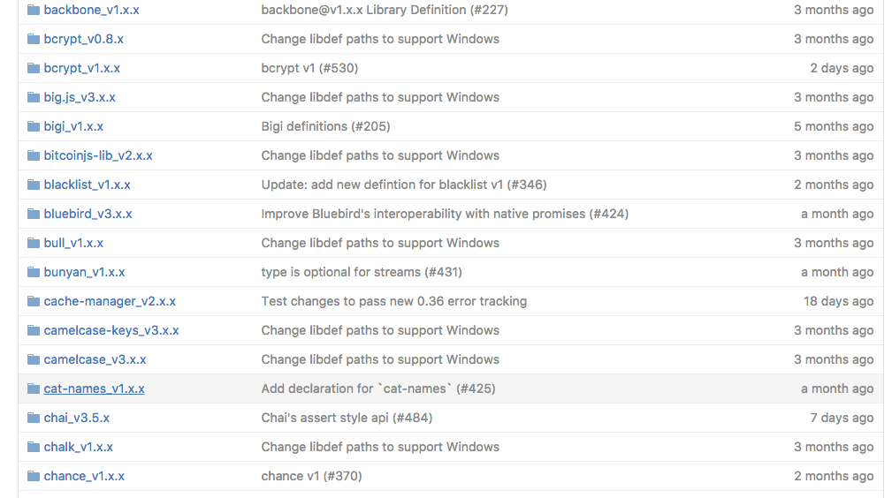
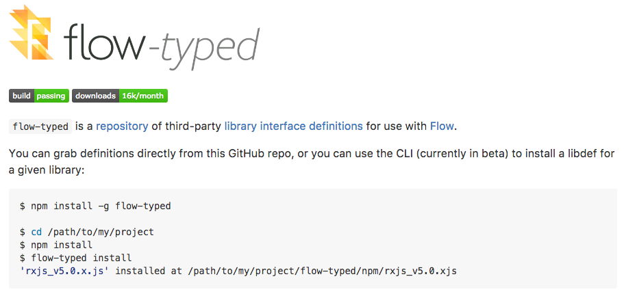
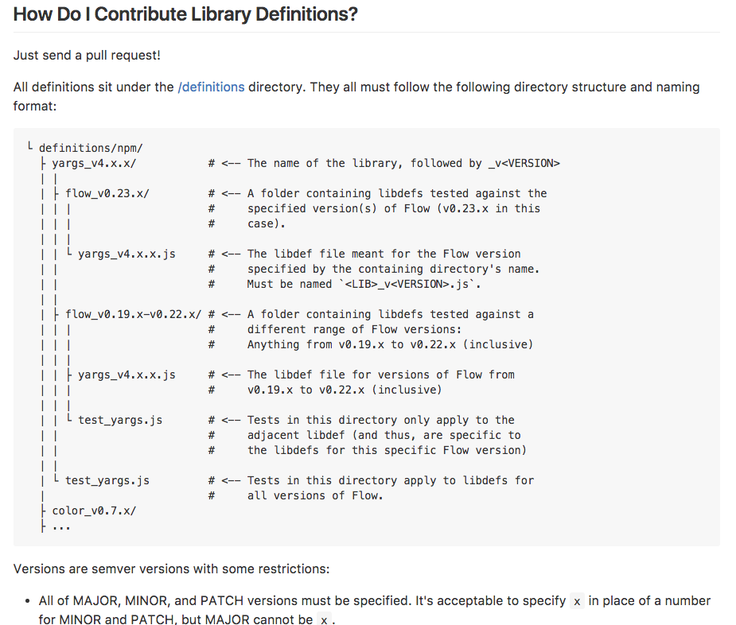
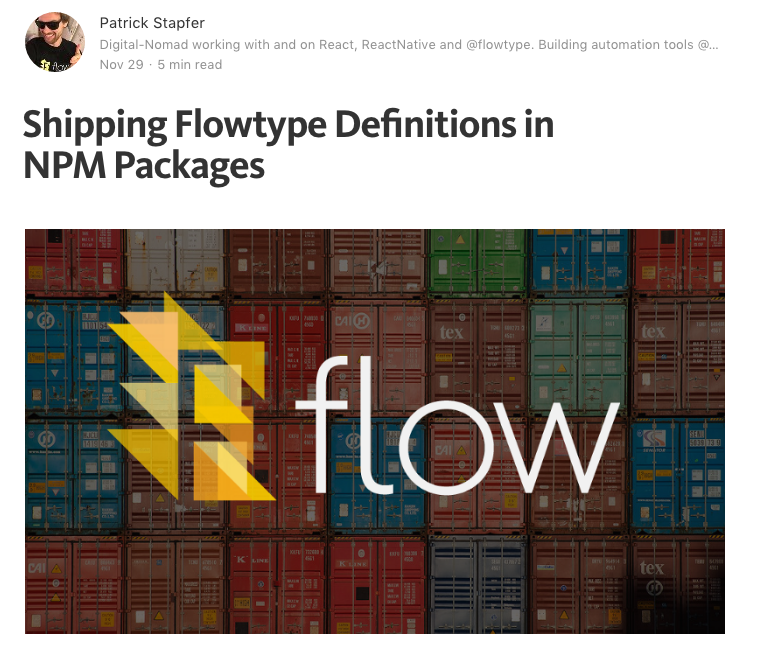

footer: #### `@ryyppy`


#  Let's Build a Great Typing Experience with 3rd Party Modules

<br>
*Patrick Stapfer*
<br>
Twitter: @ryyppy
Github: ryyppy

---

# Flowtype

Adds a type layer to your vanilla JavaScript code 

```javascript
function doSomething(a: string, b: number): string {
  return `${a} + ${b}`;
}
```

---

# How do we support types for 3rd party code? 

```javascript
import { map } from 'lodash';

// How do I teach flow about map? 
map('foo');
```

---



# With library interface definition files (libdef)!

---



---

# Flow-Typed

* Collection of High-Quality Library Definitions
* Tagged to specific flow / library versions
* Independent from the actual implementation 
* CLI for easy management

---

```
$ flow-typed search jest

Found definitions:
╔══════╤═════════════════╤══════════════╗
║ Name │ Package Version │ Flow Version ║
╟──────┼─────────────────┼──────────────╢
║ jest │ v17.x.x         │ >=v0.33.x    ║
╟──────┼─────────────────┼──────────────╢
║ jest │ v16.x.x         │ >=v0.33.x    ║
╟──────┼─────────────────┼──────────────╢
║ jest │ v14.x.x         │ >=v0.23.x    ║
╟──────┼─────────────────┼──────────────╢
║ jest │ v12.0.x         │ >=v0.23.x    ║
╚══════╧═════════════════╧══════════════╝
```

---

```
$ flow-typed install jest@17.x.x -f 0.36

• rebasing flow-typed cache...done.
• Installing 1 libdefs...
  • jest_v17.x.x.js
    └> ./flow-typed/npm/jest_v17.x.x.js
```

---

## `"./flow-typed"` is our default libdef directory

```
#.flowconfig
[ignore]

[include]

[libs]
flow-typed

[options]
```

---

# How does a libdef file look like?

---

# Declaration Syntax

```javascript
// Type declaration
declare type MyObject = { test: boolean };

// Function declaration
declare function add(a: number, b: number): number;

// Module declaration
declare module 'mymodule' { /* */ }

// Special exports declaration (CommonJS)
declare var exports: MyObject;

// Variable declaration
declare var MY_CONSTANT: string;
```

---


# Module Scoping

---

# Global Scope 

-> Everything declared outside a `declare module` context:

```javascript
// ./flow-typed/global.js
declare function foo(a: string, b: number): void;
```

```javascript
// ./main.js
foo('test', 1); // Okay
foo(1, ''); // Flow error
```

---

# CommonJS Module

```
declare module 'commonJSModule' {
  declare function notExposed(): void;
  declare type MyEntity = { id: string, name: string };

  declare type MyExport = {
    toEntity: (obj: Object) => MyEntity
  };


  declare var exports: MyExport; 
}
```

```javascript
// ./main.js
import commonJSModule from 'commonJSModule';

// $FlowExpectedError: hidden internal
import { notExposed } from 'commonJSModule'; 
```
---

# ES6 Module

```javascript
// ./flow-typed/es6module.js
declare module 'es6module' {
  declare export var buffers: Array<string>;
  declare export var otherBuffer: string;

  declare type MyES6Module = {
    buffers: typeof buffers,
  };
 
  declare export default MyES6Module;
}
```

```javascript
// ./main.js
import { buffers, otherBuffer, default as es6module } from 'es6module'; 
```
---

# "Automatic" CommonJS Module

-> If you don't provide any module specific `export` declarations

```
// ./flow-typed/autoCommonJSModule.js
declare module 'autoCommonJSModule' {
  declare function exposed1(): void;
  declare var SOME_CONSTANT: string;
}
```

```javascript
// ./main.js
import { SOME_CONSTANT, exposed1 } from 'autoCommonJSModule';
import autoCommonJSModule from 'autoCommonJSModule';
```

---

# Submodules / Namespacing

-> Namespacing is important to reuse types for submodules

```javascript
// ./flow-typed/submodules.js
declare type npm$mymodule$Shared = number;

declare module 'mymodule/lib' {
  declare type MyExport = npm$mymodule$Shared;
  declare export default MyExport;
}

declare module 'mymodule/lib/something' {
  declare var exports: {
    shared: npm$mymodule$Shared,
  };
}
```

```javascript
// ./main.js
import myModule from 'mymodule/lib';
import myModuleSomething from 'mymodule/lib/something';
```

---

# Export / Import types from libdef

-> It's also possible to export types

```javascript
declare module 'typeModule' {
  declare export type SomeType = {
    foo: string,
  };
}
```

```javascript
import type { SomeType } from 'typeModule';
const foo: SomeType = { foo: 'test' };
```
---


# Contributing libdefs to flow-typed

---



---

# Other Alternatives



---


# Typed JavaScript Is the Future 

---


# Thanks 

---

# References

* [Source-Code (Presentation)](https://github.com/ryyppy/flow-libdef-talk)
* [Flow-Typed](https://github.com/flowtype/flow-typed)
* [Shipping Flowtype Definitions in NPM Packages](https://medium.com/@ryyppy/shipping-flowtype-definitions-in-npm-packages-c987917efb65#.ss9s4wdys)
* [Flowtype Declaration Syntax](https://flowtype.org/docs/declarations.html)

